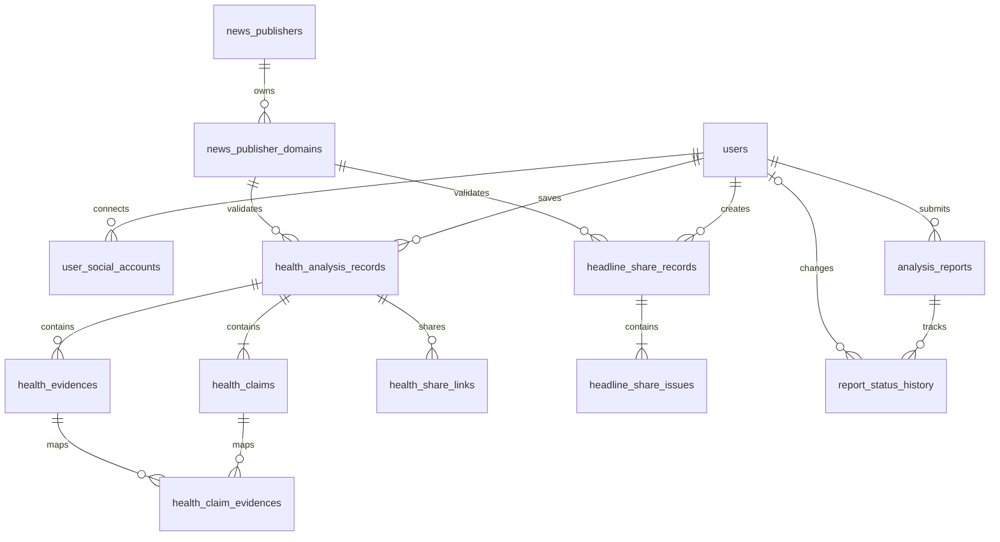

<!-- 기사체크 MVP 업무 데이터 모델과 MySQL 테이블 설계 -->
# 기사체크 MVP 데이터베이스 설계

기준 문서: `MVP_REQUIREMENTS.md` 2026-09-02 저장소 버전

대상 DBMS: MySQL 8.0.30, InnoDB, `utf8mb4_0900_ai_ci`

Local 전용 실행 DDL: `infra/mysql/schema/V0001__create_initial_domain_schema.sql` Git 제외

상세 ERDCloud: `https://www.erdcloud.com/d/GtYigLShb3E3wDLpA` (Private, 로그인 필요)

ERDCloud에는 13개 물리 테이블과 컬럼 타입, PK/FK, NULL 허용 여부, UNIQUE, DEFAULT, AUTO_INCREMENT, COMMENT, FK 대상 관계를 반영했다. 한국어 논리명과 상세 설명은 이 문서의 테이블 정의를 기준으로 함께 관리한다.

## 1. 요구사항 분석 요약

기사체크는 계정·인증, 지원 언론사, 건강 뉴스 분석, 제목 분석 공유, 신고·관리자 처리 데이터를 관리한다. 분석 원문을 축적하는 서비스가 아니므로 기사 본문, 비회원 결과, 임시 인증번호, 세션, 일일 이용량, 3일 공용 캐시는 MySQL 영속 범위에서 제외한다.

영속 데이터 경계는 다음과 같다.

| 영역 | MySQL 저장 | 저장하지 않거나 Redis 사용 | 근거 |
| --- | --- | --- | --- |
| 회원 | 계정, 소셜 식별자, 사용자별 초대 코드 검증 완료 사실 | 세션, 이메일 인증번호와 재발송 제한 | 장기 계정 무결성과 단기 보안 데이터 분리 |
| 언론사 | 허용 언론사와 정확한 호스트명, 지원 상태 | 최근 1시간 추출 성공·실패 윈도 | SSRF 허용 목록은 영속화하고 고빈도 윈도 집계는 Redis/메트릭 사용 |
| 건강 분석 | 사용자가 명시적으로 저장한 결과·주장·근거 | 비회원 결과, 저장 전 결과, 기사 원문 | 명시적 저장과 최소 수집 원칙 |
| 제목 분석 | 공유한 결과의 7일 스냅샷만 저장 | 회원 히스토리, 저장하지 않은 결과 | 제목 결과 히스토리 금지 |
| 공유 | 토큰 원문이 아닌 다이제스트, 결과 연결/스냅샷 | 검색엔진·메신저 캐시 | 7일 수명과 토큰 유출 피해 축소 |
| 신고 | 신고 당시 결과 스냅샷, 현재 상태와 상태 이력 | 화면 캡처·첨부 파일 | 재분석·기록 삭제 뒤에도 신고 당시 내용 유지 |
| 이용량·캐시 | 없음 | Redis, 한국시간 기준 TTL | 자정/3일 만료 데이터이며 Redis 장애 시 새 AI 분석을 중단 |

### 정규화와 반정규화 판단

- 회원과 소셜 공급자 식별자를 분리해 한 일반 회원이 여러 소셜 계정을 연결할 수 있게 한다.
- 언론사와 허용 호스트명을 분리해 한 언론사의 복수 도메인을 정확하게 검사한다.
- 건강 결과는 `결과 → 주장`, `결과 → 근거`, `주장 N:M 근거`로 정규화한다.
- 건강 결과의 주장 수·근거 있음 수·확인률·종합 상태는 목록/공유 조회 성능과 고정 규칙 결과 보존을 위해 결과 테이블에 반정규화한다. 애플리케이션은 결과 저장 트랜잭션에서 자식 주장과 일치 여부를 검증해야 한다.
- 제목 분석은 7일 후 사라지는 독립 스냅샷이므로 건강 결과와 하나의 다형 테이블로 합치지 않는다.
- 신고 당시 결과는 원본 결과가 재분석·삭제되어도 바뀌면 안 되므로 `JSON` 불변 스냅샷으로 저장한다. 자주 조회하는 신고 유형·상태·기사 정보는 일반 컬럼으로 분리한다.
- 기사 URL과 근거 URL은 표시용 원문과 조회/중복 확인용 SHA-256 다이제스트를 함께 둔다. 긴 URL을 직접 인덱싱하지 않는다.

### 불명확하거나 충돌하는 부분

- 초기 지원 언론사는 “서버 설정”으로 관리하도록 되어 있으나 자동 비활성화 상태도 저장해야 한다. 이 설계는 MySQL의 언론사 테이블을 서버 설정 저장소로 간주한다.
- 제목 공유 최소 데이터의 “기존 제목”과 “기사 제목”은 동일 개념으로 해석해 `article_title` 하나로 저장한다.
- 신고 당시 결과의 상세 구조와 최대 크기는 명시되지 않았다. 검색 가능한 공통 필드는 컬럼으로, 분석 유형별 상세는 버전이 포함된 JSON으로 저장한다.
- 전문가 검토 기능은 MVP에서 제외됐지만 상태 저장 준비가 요구된다. 현재는 상태·완료 일시만 두고 리뷰어 자격·워크플로 테이블은 만들지 않는다.

### 초대 코드 설정 전략

초대 코드 테이블과 사용 이력 테이블은 만들지 않는다. 운영자가 정한 코드는 환경변수로 주입하고 Spring Boot의 타입 안전 설정 객체에서 검증한다. 저장소에는 실제 코드를 기록하지 않으며 값이 없으면 애플리케이션 시작 또는 가입 처리를 실패시킨다.

```yaml
invite:
  code: ${INVITE_CODE}
```

```java
@ConfigurationProperties(prefix = "invite")
public record InviteProperties(String code) {}
```

단일 문자열만 필요해도 설정 검증과 테스트 대체가 쉬운 `@ConfigurationProperties`를 우선한다. `@Value("${invite.code}")`도 가능하지만 실제 초대 코드의 기본값을 소스에 두지 않는다. 가입 서비스는 상수 시간 비교로 입력값을 확인하고, 성공한 계정 생성 시 `users.invite_code_verified_at`을 명시적으로 저장한다.

## 2. 주요 엔티티 목록

| 엔티티 | 역할 |
| --- | --- |
| 사용자 | 일반·소셜 회원, 권한, 이메일 확인, 로그인 잠금, 탈퇴 유예 상태 관리 |
| 사용자 소셜 계정 | 공급자 고유 식별자와 회원 연결 |
| 언론사·언론사 도메인 | 지원 상태와 SSRF 허용 호스트 관리 |
| 건강 분석 기록 | 회원이 저장한 30일 결과와 판정 요약 관리 |
| 건강 핵심 주장 | 최대 세 개 주장과 주장별 상태·이유 관리 |
| 건강 근거 | 공식 기관·PubMed 근거 메타데이터 스냅샷 관리 |
| 주장-근거 연결 | 한 근거가 여러 주장에 쓰이는 N:M 관계와 요약 관리 |
| 건강 공유 링크 | 저장 건강 결과의 7일 공유 접근 관리 |
| 제목 공유 결과·문제 유형 | 히스토리 없이 공유에 필요한 제목 분석만 7일 관리 |
| 분석 결과 신고 | 신고 당시 결과와 현재 관리자 처리 상태 관리 |
| 신고 상태 이력 | 관리자 상태·답변 변경 추적 |

## 3. 엔티티 관계

- 사용자 1 : N 사용자 소셜 계정
- 언론사 1 : N 언론사 도메인
- 사용자 1 : N 건강 분석 기록
- 언론사 도메인 1 : N 건강 분석 기록
- 건강 분석 기록 1 : N 건강 핵심 주장(1~3개)
- 건강 분석 기록 1 : N 건강 근거
- 건강 핵심 주장 N : M 건강 근거(`health_claim_evidences` 중간 테이블)
- 건강 분석 기록 1 : N 건강 공유 링크(생성자는 건강 기록의 소유자로 도출)
- 사용자 1 : N 제목 공유 결과
- 제목 공유 결과 1 : N 제목 문제 유형(1~4개)
- 사용자 1 : N 분석 결과 신고
- 분석 결과 신고 1 : N 신고 상태 이력
- 관리자 사용자 1 : N 신고 처리 및 신고 상태 이력

## 4. DB 테이블 목록

| 논리 테이블명 | 물리 테이블명 | 역할 | 주요 관계 |
| --- | --- | --- | --- |
| 사용자 | `users` | 계정·권한·상태 | 소셜, 건강 기록, 공유, 신고의 부모 |
| 사용자 소셜 계정 | `user_social_accounts` | OAuth 공급자 식별자 연결 | `users` N:1 |
| 지원 언론사 | `news_publishers` | 언론사 지원 상태 | 도메인 1:N |
| 언론사 허용 도메인 | `news_publisher_domains` | 정확한 허용 호스트 | 언론사 N:1, 분석 N:1 |
| 건강 분석 기록 | `health_analysis_records` | 명시 저장한 30일 결과 | 사용자·도메인 N:1, 주장·근거·공유 1:N |
| 건강 핵심 주장 | `health_claims` | 최대 세 개 주장 | 건강 기록 N:1, 근거 N:M |
| 건강 근거 | `health_evidences` | 근거 메타데이터 스냅샷 | 건강 기록 N:1, 주장 N:M |
| 주장-근거 연결 | `health_claim_evidences` | N:M 관계와 설명 | 주장·근거 연결 |
| 건강 공유 링크 | `health_share_links` | 저장 결과 7일 공유 | 건강 기록 N:1 |
| 제목 공유 결과 | `headline_share_records` | 제목 분석 7일 스냅샷 | 사용자·도메인 N:1, 문제 1:N |
| 제목 공유 문제 | `headline_share_issues` | 복수 제목 판정과 이유 | 제목 공유 N:1 |
| 분석 결과 신고 | `analysis_reports` | 신고 스냅샷과 현재 처리 상태 | 사용자 N:1, 이력 1:N |
| 신고 상태 이력 | `report_status_history` | 관리자 처리 변경 이력 | 신고·관리자 N:1 |

## 5. 테이블 상세 정의

표의 `NULL`은 허용 여부다. PK와 UNIQUE는 모두 `NULL=N`이다. `BINARY(32)` 다이제스트는 애플리케이션이 SHA-256 결과 32바이트를 저장한다.

### 테이블: 사용자 (`users`)

역할: 일반·소셜 회원의 공통 계정, 서버 권한, 이메일 확인, 로그인 잠금과 7일 탈퇴 유예를 관리한다. 탈퇴 유예는 soft delete가 아니라 복구 가능한 업무 상태다.

| 컬럼명 | 타입 | PK | FK | NULL | UNIQUE | DEFAULT | 설명 / 참조 |
| --- | --- | --- | --- | --- | --- | --- | --- |
| `id` | BIGINT UNSIGNED | Y | N | N | Y | AUTO_INCREMENT | 사용자 식별자 |
| `account_type` | VARCHAR(20) | N | N | N | N | - | `LOCAL`, `SOCIAL` |
| `role` | VARCHAR(20) | N | N | N | N | `USER` | `USER`, `ADMIN` |
| `status` | VARCHAR(30) | N | N | N | N | - | `PENDING_EMAIL`, `ACTIVE`, `WITHDRAWAL_PENDING` |
| `email` | VARCHAR(320) | N | N | N | Y | - | 소문자 정규화 이메일 |
| `username` | VARCHAR(20) | N | N | Y | Y | - | 일반 회원 아이디 |
| `password_hash` | VARCHAR(255) | N | N | Y | N | - | 비밀번호 단방향 해시 |
| `phone_number` | VARCHAR(11) | N | N | Y | Y | - | 하이픈 제거 번호 |
| `email_verified_at` | TIMESTAMP(6) | N | N | Y | N | - | 이메일 확인 완료 일시 |
| `invite_code_verified_at` | TIMESTAMP(6) | N | N | N | N | - | 설정 초대 코드 검증 완료 일시, 가입 시 명시 입력 |
| `failed_login_count` | TINYINT UNSIGNED | N | N | N | N | `0` | 연속 실패 횟수 |
| `login_locked_until` | TIMESTAMP(6) | N | N | Y | N | - | 잠금 종료 일시 |
| `withdrawal_requested_at` | TIMESTAMP(6) | N | N | Y | N | - | 탈퇴 신청 일시 |
| `scheduled_deletion_at` | TIMESTAMP(6) | N | N | Y | N | - | 탈퇴 확정 예정 일시 |
| `created_at` | TIMESTAMP(6) | N | N | N | N | CURRENT_TIMESTAMP | 생성 일시 |
| `updated_at` | TIMESTAMP(6) | N | N | N | N | CURRENT_TIMESTAMP | 수정 일시 |
| `version` | BIGINT UNSIGNED | N | N | N | N | `0` | 낙관적 잠금 |

주요 제약: 계정 유형별 필수 필드를 `CHECK`로 구분하고 이메일·아이디·전화번호는 전체 사용자에서 중복을 막는다. `ADMIN` 부여는 DB 운영 절차로만 수행한다.

### 테이블: 사용자 소셜 계정 (`user_social_accounts`)

역할: 로그인 이메일이 아닌 공급자 고유 식별자로 로그인하며, 일반 회원의 소셜 연결과 소셜 전용 가입 수단을 구분한다.

| 컬럼명 | 타입 | PK | FK | NULL | UNIQUE | DEFAULT | 설명 / 참조 |
| --- | --- | --- | --- | --- | --- | --- | --- |
| `id` | BIGINT UNSIGNED | Y | N | N | Y | AUTO_INCREMENT | 연결 식별자 |
| `user_id` | BIGINT UNSIGNED | N | Y | N | 복합 | - | `users.id`, 삭제 CASCADE |
| `provider` | VARCHAR(20) | N | N | N | 복합 | - | `KAKAO`, `GOOGLE`, `NAVER` |
| `provider_subject` | VARCHAR(255) | N | N | N | 복합 | - | 공급자 사용자 ID, `(provider, provider_subject)` UNIQUE |
| `provider_email` | VARCHAR(320) | N | N | N | N | - | 공급자 확인 이메일 스냅샷 |
| `is_signup_identity` | BOOLEAN | N | N | N | N | FALSE | 최초 소셜 가입 수단 |
| `connected_at` | TIMESTAMP(6) | N | N | N | N | CURRENT_TIMESTAMP | 연결 일시 |
| `updated_at` | TIMESTAMP(6) | N | N | N | N | CURRENT_TIMESTAMP | 수정 일시 |

추가 UNIQUE: `(user_id, provider)`로 같은 회원의 동일 공급자 중복 연결을 막는다. 소셜 전용 회원의 연결 1개 제한은 다른 회원 유형의 합법적인 다중 연결과 충돌하므로 서비스 계층에서 검사한다.

### 테이블: 지원 언론사 (`news_publishers`)

역할: 후보·지원·자동 중단·수동 중단 상태를 저장한다. 별도 관리자 화면 없이 운영 SQL/관리 절차로 다시 활성화한다.

| 컬럼명 | 타입 | PK | FK | NULL | UNIQUE | DEFAULT | 설명 / 참조 |
| --- | --- | --- | --- | --- | --- | --- | --- |
| `id` | BIGINT UNSIGNED | Y | N | N | Y | AUTO_INCREMENT | 언론사 식별자 |
| `name` | VARCHAR(100) | N | N | N | Y | - | 표시명 |
| `status` | VARCHAR(30) | N | N | N | N | `CANDIDATE` | `CANDIDATE`, `ACTIVE`, `PAUSED_AUTO`, `PAUSED_MANUAL` |
| `status_reason` | VARCHAR(255) | N | N | Y | N | - | 중단 사유 |
| `auto_disabled_at` | TIMESTAMP(6) | N | N | Y | N | - | 자동 중단 일시 |
| `status_changed_at` | TIMESTAMP(6) | N | N | N | N | CURRENT_TIMESTAMP | 상태 변경 일시 |
| `created_at` | TIMESTAMP(6) | N | N | N | N | CURRENT_TIMESTAMP | 생성 일시 |
| `updated_at` | TIMESTAMP(6) | N | N | N | N | CURRENT_TIMESTAMP | 수정 일시 |
| `version` | BIGINT UNSIGNED | N | N | N | N | `0` | 동시 상태 변경 보호 |

### 테이블: 언론사 허용 도메인 (`news_publisher_domains`)

역할: URL·리디렉션의 최종 호스트를 정확히 비교하기 위한 허용 목록이다. 와일드카드 대신 실제 통과한 호스트를 행으로 등록한다.

| 컬럼명 | 타입 | PK | FK | NULL | UNIQUE | DEFAULT | 설명 / 참조 |
| --- | --- | --- | --- | --- | --- | --- | --- |
| `id` | BIGINT UNSIGNED | Y | N | N | Y | AUTO_INCREMENT | 도메인 식별자 |
| `publisher_id` | BIGINT UNSIGNED | N | Y | N | N | - | `news_publishers.id`, 삭제 RESTRICT |
| `hostname` | VARCHAR(253) | N | N | N | Y | - | 소문자 ASCII 호스트명 |
| `status` | VARCHAR(20) | N | N | N | N | `ACTIVE` | `ACTIVE`, `PAUSED` |
| `created_at` | TIMESTAMP(6) | N | N | N | N | CURRENT_TIMESTAMP | 생성 일시 |
| `updated_at` | TIMESTAMP(6) | N | N | N | N | CURRENT_TIMESTAMP | 수정 일시 |

### 테이블: 건강 분석 기록 (`health_analysis_records`)

역할: 회원이 저장 버튼을 누른 결과만 30일 보관한다. 재분석 성공 시 동일 행과 자식을 한 트랜잭션에서 교체하고 기존 공유를 해제한다.

| 컬럼명 | 타입 | PK | FK | NULL | UNIQUE | DEFAULT | 설명 / 참조 |
| --- | --- | --- | --- | --- | --- | --- | --- |
| `id` | BIGINT UNSIGNED | Y | N | N | Y | AUTO_INCREMENT | 저장 결과 식별자 |
| `user_id` | BIGINT UNSIGNED | N | Y | N | N | - | `users.id`, 삭제 CASCADE |
| `publisher_domain_id` | BIGINT UNSIGNED | N | Y | N | N | - | `news_publisher_domains.id`, 삭제 RESTRICT |
| `article_url` | VARCHAR(2048) | N | N | N | N | - | 검증한 최종 기사 URL |
| `normalized_url_digest` | BINARY(32) | N | N | N | N | - | 정규화 URL SHA-256 |
| `article_title` | VARCHAR(500) | N | N | N | N | - | 분석 당시 제목 |
| `article_published_at` | DATETIME(6) | N | N | Y | N | - | 기사 게시 시각 |
| `article_modified_at` | DATETIME(6) | N | N | Y | N | - | 기사 수정 시각 |
| `analyzed_at` | TIMESTAMP(6) | N | N | N | N | - | 현재 결과 분석 시각 |
| `expires_at` | TIMESTAMP(6) | N | N | N | N | - | 30일 삭제 예정 시각 |
| `overall_status` | VARCHAR(30) | N | N | N | N | - | `RELIABLE`, `CAUTION`, `DOUBTFUL` |
| `total_claim_count` | TINYINT UNSIGNED | N | N | N | N | - | 1~3 주장 수 |
| `supported_claim_count` | TINYINT UNSIGNED | N | N | N | N | - | `SUPPORTED` 수 |
| `verification_rate` | DECIMAL(5,2) | N | N | N | N | - | 0~100 확인률 |
| `expert_review_status` | VARCHAR(20) | N | N | N | N | `NOT_REVIEWED` | `NOT_REVIEWED`, `REVIEWED` |
| `expert_reviewed_at` | TIMESTAMP(6) | N | N | Y | N | - | 검토 완료 시각 |
| `ai_model_version` | VARCHAR(100) | N | N | N | N | - | 모델 버전 |
| `policy_version` | VARCHAR(100) | N | N | N | N | - | 판정 규칙 버전 |
| `evidence_allowlist_version` | VARCHAR(100) | N | N | N | N | - | 근거 허용 목록 버전 |
| `created_at` | TIMESTAMP(6) | N | N | N | N | CURRENT_TIMESTAMP | 최초 저장 일시 |
| `updated_at` | TIMESTAMP(6) | N | N | N | N | CURRENT_TIMESTAMP | 재분석 교체 일시 |
| `version` | BIGINT UNSIGNED | N | N | N | N | `0` | 재분석 동시성 보호 |

### 테이블: 건강 핵심 주장 (`health_claims`)

역할: 분석에서 추출한 최대 세 개 주장을 중요도 순으로 저장한다.

| 컬럼명 | 타입 | PK | FK | NULL | UNIQUE | DEFAULT | 설명 / 참조 |
| --- | --- | --- | --- | --- | --- | --- | --- |
| `id` | BIGINT UNSIGNED | Y | N | N | Y | AUTO_INCREMENT | 주장 식별자 |
| `health_analysis_record_id` | BIGINT UNSIGNED | N | Y | N | 복합 | - | `health_analysis_records.id`, 삭제 CASCADE |
| `claim_order` | TINYINT UNSIGNED | N | N | N | 복합 | - | 중요도 1~3, 부모 내 UNIQUE |
| `claim_text` | TEXT | N | N | N | N | - | 핵심 주장 |
| `status` | VARCHAR(30) | N | N | N | N | - | `SUPPORTED`, `NEEDS_REVIEW`, `CONTRADICTED`, `INSUFFICIENT` |
| `easy_reason` | TEXT | N | N | N | N | - | 쉬운 판정 이유 |
| `created_at` | TIMESTAMP(6) | N | N | N | N | CURRENT_TIMESTAMP | 생성 일시 |

### 테이블: 건강 근거 (`health_evidences`)

역할: 분석 당시 화면에 제공한 공식 기관·PubMed 메타데이터를 결과 단위 스냅샷으로 저장한다. 원문 전문이나 긴 인용은 저장하지 않는다.

| 컬럼명 | 타입 | PK | FK | NULL | UNIQUE | DEFAULT | 설명 / 참조 |
| --- | --- | --- | --- | --- | --- | --- | --- |
| `id` | BIGINT UNSIGNED | Y | N | N | Y | AUTO_INCREMENT | 근거 식별자 |
| `health_analysis_record_id` | BIGINT UNSIGNED | N | Y | N | 복합 | - | `health_analysis_records.id`, 삭제 CASCADE |
| `source_kind` | VARCHAR(20) | N | N | N | N | - | `OFFICIAL`, `PUBMED` |
| `source_identifier` | VARCHAR(100) | N | N | Y | N | - | PMID, DOI, 기관 문서 ID |
| `title` | VARCHAR(1000) | N | N | N | N | - | 자료명 |
| `provider_name` | VARCHAR(255) | N | N | N | N | - | 기관 또는 학술지 |
| `study_type` | VARCHAR(40) | N | N | Y | N | - | 지침·메타분석·시험 등 |
| `publication_date` | DATE | N | N | Y | N | - | 발행/갱신일 |
| `source_url` | VARCHAR(2048) | N | N | N | N | - | 검증한 원문 URL |
| `source_url_digest` | BINARY(32) | N | N | N | 복합 | - | 결과 내 URL 중복 방지 |
| `created_at` | TIMESTAMP(6) | N | N | N | N | CURRENT_TIMESTAMP | 생성 일시 |

### 테이블: 주장-근거 연결 (`health_claim_evidences`)

역할: 주장을 근거와 N:M으로 연결하고, 근거가 해당 주장에 어떻게 사용됐는지 표시한다.

| 컬럼명 | 타입 | PK | FK | NULL | UNIQUE | DEFAULT | 설명 / 참조 |
| --- | --- | --- | --- | --- | --- | --- | --- |
| `health_claim_id` | BIGINT UNSIGNED | Y | Y | N | 복합 | - | `health_claims.id`, 삭제 CASCADE |
| `health_evidence_id` | BIGINT UNSIGNED | Y | Y | N | 복합 | - | `health_evidences.id`, 삭제 CASCADE |
| `relation_type` | VARCHAR(20) | N | N | N | N | - | `SUPPORTS`, `CONTRADICTS`, `CONTEXT` |
| `evidence_order` | SMALLINT UNSIGNED | N | N | N | 복합 | - | 주장 내 표시 순서 |
| `summary` | TEXT | N | N | N | N | - | 쉬운 한국어 요약 |
| `conflict_note` | TEXT | N | N | Y | N | - | 충돌 및 우선 판단 이유 |

교차 결과의 주장과 근거가 연결되는 것은 DB FK만으로 막기 어렵다. 저장 전에 두 자식의 `health_analysis_record_id`가 같은지 서비스 계층에서 검증한다.

### 테이블: 건강 공유 링크 (`health_share_links`)

역할: 저장한 건강 결과에만 7일 읽기 전용 공유 링크를 발급한다. 토큰 원문은 저장하지 않는다.

| 컬럼명 | 타입 | PK | FK | NULL | UNIQUE | DEFAULT | 설명 / 참조 |
| --- | --- | --- | --- | --- | --- | --- | --- |
| `id` | BIGINT UNSIGNED | Y | N | N | Y | AUTO_INCREMENT | 공유 식별자 |
| `health_analysis_record_id` | BIGINT UNSIGNED | N | Y | N | N | - | `health_analysis_records.id`, 삭제 CASCADE |
| `token_digest` | BINARY(32) | N | N | N | Y | - | 임의 토큰 SHA-256 |
| `short_summary` | VARCHAR(300) | N | N | N | N | - | 메신저 미리보기 요약 |
| `created_at` | TIMESTAMP(6) | N | N | N | N | CURRENT_TIMESTAMP | 생성 일시 |
| `expires_at` | TIMESTAMP(6) | N | N | N | N | - | 만료 일시 |
| `revoked_at` | TIMESTAMP(6) | N | N | Y | N | - | 해제/재분석 만료 일시 |

### 테이블: 제목 공유 결과 (`headline_share_records`)

역할: 회원 히스토리를 만들지 않고 공유에 필요한 제목 분석만 7일 저장한다.

| 컬럼명 | 타입 | PK | FK | NULL | UNIQUE | DEFAULT | 설명 / 참조 |
| --- | --- | --- | --- | --- | --- | --- | --- |
| `id` | BIGINT UNSIGNED | Y | N | N | Y | AUTO_INCREMENT | 제목 공유 식별자 |
| `created_by_user_id` | BIGINT UNSIGNED | N | Y | N | N | - | `users.id`, 삭제 CASCADE |
| `publisher_domain_id` | BIGINT UNSIGNED | N | Y | N | N | - | `news_publisher_domains.id`, 삭제 RESTRICT |
| `token_digest` | BINARY(32) | N | N | N | Y | - | 공유 토큰 다이제스트 |
| `article_url` | VARCHAR(2048) | N | N | N | N | - | 최종 기사 URL |
| `normalized_url_digest` | BINARY(32) | N | N | N | N | - | 정규화 URL 다이제스트 |
| `article_title` | VARCHAR(500) | N | N | N | N | - | 분석 당시 제목/기존 제목 |
| `alternative_title` | VARCHAR(500) | N | N | Y | N | - | 문제가 있을 때만 제안 |
| `short_summary` | VARCHAR(300) | N | N | N | N | - | 메신저 미리보기 요약 |
| `analyzed_at` | TIMESTAMP(6) | N | N | N | N | - | 분석 일시 |
| `created_at` | TIMESTAMP(6) | N | N | N | N | CURRENT_TIMESTAMP | 공유 생성 일시 |
| `expires_at` | TIMESTAMP(6) | N | N | N | N | - | 만료 일시 |
| `revoked_at` | TIMESTAMP(6) | N | N | Y | N | - | 해제 일시 |
| `ai_model_version` | VARCHAR(100) | N | N | N | N | - | 모델 버전 |
| `policy_version` | VARCHAR(100) | N | N | N | N | - | 판정 규칙 버전 |

### 테이블: 제목 공유 문제 (`headline_share_issues`)

역할: 동시에 발견된 제목 문제 유형을 각각의 이유와 함께 저장한다.

| 컬럼명 | 타입 | PK | FK | NULL | UNIQUE | DEFAULT | 설명 / 참조 |
| --- | --- | --- | --- | --- | --- | --- | --- |
| `headline_share_record_id` | BIGINT UNSIGNED | Y | Y | N | 복합 | - | `headline_share_records.id`, 삭제 CASCADE |
| `issue_order` | TINYINT UNSIGNED | Y | N | N | 복합 | - | 표시 순서 1~4 |
| `issue_type` | VARCHAR(30) | N | N | N | 복합 | - | `NO_ISSUE`, `EXAGGERATED`, `OMITS_CONTEXT`, `MISMATCH` |
| `reason` | TEXT | N | N | N | N | - | 유형별 판정 이유 |

`NO_ISSUE`와 다른 유형의 동시 저장 금지는 서비스 계층에서 검증한다. 문제가 하나 이상이면 `alternative_title`이 필수이고 `NO_ISSUE`이면 `NULL`이어야 한다.

### 테이블: 분석 결과 신고 (`analysis_reports`)

역할: 신고 당시 결과·근거 링크·기사 URL을 불변 스냅샷으로 보존하고 현재 처리 상태와 관리자 답변을 제공한다.

| 컬럼명 | 타입 | PK | FK | NULL | UNIQUE | DEFAULT | 설명 / 참조 |
| --- | --- | --- | --- | --- | --- | --- | --- |
| `id` | BIGINT UNSIGNED | Y | N | N | Y | AUTO_INCREMENT | 신고 식별자 |
| `reporter_user_id` | BIGINT UNSIGNED | N | Y | N | N | - | `users.id`, 탈퇴 확정 시 CASCADE |
| `report_type` | VARCHAR(40) | N | N | N | N | - | 다섯 가지 문제 유형 |
| `analysis_type` | VARCHAR(20) | N | N | N | N | - | `HEALTH`, `HEADLINE` |
| `description` | VARCHAR(2000) | N | N | N | N | - | 사용자 설명 |
| `article_url` | VARCHAR(2048) | N | N | N | N | - | 신고 당시 URL |
| `article_title` | VARCHAR(500) | N | N | N | N | - | 신고 당시 제목 |
| `result_snapshot` | JSON | N | N | N | N | - | 스키마 버전을 포함한 결과·근거 스냅샷 |
| `status` | VARCHAR(20) | N | N | N | N | `OPEN` | `OPEN`, `IN_PROGRESS`, `RESOLVED` |
| `admin_reply` | VARCHAR(1000) | N | N | Y | N | - | 사용자용 짧은 답변 |
| `handled_by_user_id` | BIGINT UNSIGNED | N | Y | Y | N | - | `users.id`, 관리자 삭제 시 SET NULL |
| `completed_at` | TIMESTAMP(6) | N | N | Y | N | - | 처리 완료 일시 |
| `created_at` | TIMESTAMP(6) | N | N | N | N | CURRENT_TIMESTAMP | 신고 일시 |
| `updated_at` | TIMESTAMP(6) | N | N | N | N | CURRENT_TIMESTAMP | 수정 일시 |
| `version` | BIGINT UNSIGNED | N | N | N | N | `0` | 관리자 동시 처리 보호 |

### 테이블: 신고 상태 이력 (`report_status_history`)

역할: 신고 상태와 답변이 언제 누구에 의해 바뀌었는지 보존한다. 신고가 30일 정책으로 삭제되면 함께 삭제한다.

| 컬럼명 | 타입 | PK | FK | NULL | UNIQUE | DEFAULT | 설명 / 참조 |
| --- | --- | --- | --- | --- | --- | --- | --- |
| `id` | BIGINT UNSIGNED | Y | N | N | Y | AUTO_INCREMENT | 이력 식별자 |
| `report_id` | BIGINT UNSIGNED | N | Y | N | N | - | `analysis_reports.id`, 삭제 CASCADE |
| `from_status` | VARCHAR(20) | N | N | Y | N | - | 최초 이력은 NULL 가능 |
| `to_status` | VARCHAR(20) | N | N | N | N | - | 변경 후 상태 |
| `admin_reply_snapshot` | VARCHAR(1000) | N | N | Y | N | - | 변경 시점 답변 |
| `changed_by_user_id` | BIGINT UNSIGNED | N | Y | Y | N | - | `users.id`, 관리자 삭제 시 SET NULL |
| `changed_at` | TIMESTAMP(6) | N | N | N | N | CURRENT_TIMESTAMP | 변경 일시 |

## 6. INDEX 설계

PK와 UNIQUE 제약으로 생성되는 인덱스 외의 조회 인덱스만 정리한다.

| 테이블 | INDEX | 컬럼 | UNIQUE | 설계 이유 |
| --- | --- | --- | --- | --- |
| `users` | `idx_users_status_deletion` | `status, scheduled_deletion_at` | N | 7일 탈퇴 확정 배치 후보 조회 |
| `users` | `idx_users_status_created` | `status, created_at` | N | 7일 미인증 계정 삭제 배치 후보 조회 |
| `news_publishers` | `idx_news_publishers_status` | `status, name` | N | 화면의 지원/일시 중단 목록 분리 |
| `news_publisher_domains` | `idx_publisher_domains_publisher_status` | `publisher_id, status` | N | 언론사별 활성 허용 호스트 로딩 |
| `health_analysis_records` | `idx_health_records_user_analyzed` | `user_id, analyzed_at DESC` | N | 회원 히스토리 최신순 조회 |
| `health_analysis_records` | `idx_health_records_user_url` | `user_id, normalized_url_digest` | N | 같은 사용자의 저장 결과·재분석 대상 찾기 |
| `health_analysis_records` | `idx_health_records_expires` | `expires_at` | N | 30일 만료 배치 |
| `health_analysis_records` | `idx_health_records_publisher` | `publisher_domain_id` | N | 삭제 RESTRICT FK와 운영 영향 조회 |
| `health_claim_evidences` | `idx_claim_evidences_evidence` | `health_evidence_id` | N | 근거에서 연결 주장 역조회와 FK 삭제 |
| `health_share_links` | `idx_health_share_record_active` | `health_analysis_record_id, revoked_at, expires_at` | N | 재분석 시 기존 활성 링크 일괄 만료 |
| `health_share_links` | `idx_health_share_expires` | `expires_at` | N | 7일 만료 정리 |
| `headline_share_records` | `idx_headline_share_creator_created` | `created_by_user_id, created_at DESC` | N | 생성자의 해제 대상 확인 |
| `headline_share_records` | `idx_headline_share_expires` | `expires_at` | N | 7일 만료 정리 |
| `headline_share_records` | `idx_headline_share_publisher` | `publisher_domain_id` | N | 삭제 RESTRICT FK와 운영 영향 조회 |
| `analysis_reports` | `idx_reports_user_created` | `reporter_user_id, created_at DESC` | N | 내 신고 내역 최신순 조회 |
| `analysis_reports` | `idx_reports_status_created` | `status, created_at` | N | 관리자 미처리/처리 중 큐 조회 |
| `analysis_reports` | `idx_reports_completed` | `completed_at` | N | 처리 완료 30일 뒤 삭제 배치 |
| `analysis_reports` | `idx_reports_handler` | `handled_by_user_id` | N | 관리자 FK와 처리 감사 조회 |
| `report_status_history` | `idx_report_history_report_changed` | `report_id, changed_at` | N | 신고별 처리 타임라인 조회 |
| `report_status_history` | `idx_report_history_actor` | `changed_by_user_id` | N | 관리자 변경 감사와 FK 유지 |

공유 조회는 `token_digest` UNIQUE 인덱스를 사용한다. 긴 URL과 JSON에는 MVP 조회 요구가 없으므로 인덱스를 만들지 않는다. 데이터 규모가 작은 MVP에서 전문 검색·커버링 인덱스는 추가하지 않는다.

## 7. 삭제 및 데이터 이력 정책

| 테이블/데이터 | 정책 | 이력·Audit | 이유 |
| --- | --- | --- | --- |
| `users` | 탈퇴 신청 7일간 상태 보존 후 Physical Delete | 일반 상태 이력 없음 | 사용자 복구 요구는 상태로 충족하며 확정 뒤 개인정보 최소화 |
| 미인증 일반 회원 | 생성 7일 후 Physical Delete | 없음 | 요구사항의 관련 데이터 삭제 |
| `user_social_accounts` | 사용자와 CASCADE | 없음 | 독립 보존 가치 없음 |
| 언론사·도메인 | Physical Delete 금지, 상태 전환 | `status_reason`, 상태 시각 | 저장 결과 FK와 허용 목록 운영 일관성 |
| 건강 분석 기록·자식 | 30일 또는 사용자 삭제 시 Physical Delete | 재분석 과거 버전 미보관 | 요구사항이 이전 결과와 변경 내역 미보관 명시 |
| 건강 공유 링크 | 즉시 접근 해제, 7일 만료 정리 또는 부모와 CASCADE | `revoked_at` | 재분석·삭제 시 즉시 만료 확인 |
| 제목 공유 결과·문제 | 해제/7일 만료/탈퇴 시 Physical Delete | 없음 | 공유 최소 데이터만 7일 저장 |
| 신고 | 미처리는 보존, 완료 30일 후 또는 탈퇴 확정 시 Physical Delete | 상태 이력 보관 | 신고 당시 내용 유지와 보존 기한 동시 충족 |
| 신고 상태 이력 | 신고와 CASCADE | 전용 Audit | 상태와 답변 변경 추적 |
| 세션·인증번호·이용량·캐시 | Redis TTL Physical Expiry | 운영 메트릭만 비식별 집계 | 짧은 수명, 원문·개인정보 최소화 |

만료 배치는 `(expires_at/completed_at/scheduled_deletion_at, id)` 순서로 작은 묶음을 삭제해 장시간 잠금을 피한다. 현재 예상 규모는 최대 5명이므로 파티셔닝은 적용하지 않는다. 공개 서비스에서 월 수백만 건 이상으로 커지고 보존 정책이 유지될 때 공유·신고 테이블의 월 단위 파티셔닝을 재검토한다.

## 8. DDL

실제 실행 가능한 초기 DDL은 다음 Local 전용 SQL이 원본이다.

```text
infra/mysql/schema/V0001__create_initial_domain_schema.sql
```

DDL은 13개 `CREATE TABLE`, PK, FK 삭제 정책, UNIQUE, NOT NULL, DEFAULT, CHECK, 조회·만료 인덱스, 컬럼·테이블 COMMENT를 포함한다. DB 내부 스키마 이력 테이블은 만들지 않는다. 초기 SQL은 Git에서 제외하며, 이 문서는 Git에서 관리하는 설계 검토 기준이다.

## 9. 설계 가정 및 확인 필요사항

### 설계 가정

- 이메일은 앞뒤 공백 제거와 소문자 정규화 후 전체 계정에서 UNIQUE로 관리한다.
- 휴대전화 번호는 표시 형식과 분리해 숫자 11자리로 저장한다.
- 초대 코드 원문은 Spring Boot 설정 또는 환경변수에만 두며 DB에는 저장하지 않는다.
- 가입 트랜잭션에서 설정 코드 검증 후 `users.invite_code_verified_at`을 기록한다. 이메일·아이디·전화번호·소셜 식별자의 UNIQUE 제약과 가입 멱등성 키로 같은 사용자의 중복 계정 생성을 막는다.
- 설정 초대 코드는 여러 가입자가 사용할 수 있다. 전역 일회용 코드가 필요해지면 별도 사용 이력 없이 영구 소모를 보장할 수 없으므로 정책과 데이터 모델을 다시 결정한다.
- 공유 토큰은 충분한 엔트로피의 원문을 사용자에게 전달하고 DB에는 SHA-256 다이제스트만 저장한다.
- 언론사 허용 목록의 Source of Truth는 MySQL이며 초기 후보 입력은 별도 후속 SQL/운영 절차로 수행한다. 후보 20곳을 `ACTIVE`로 미리 넣지 않는다.
- 언론사 최근 1시간 추출 실패율과 기능별 일일 이용량은 Redis 또는 메트릭 저장소에서 TTL로 집계한다.
- 모든 보존 기한은 애플리케이션에서 한국시간 정책으로 계산한 절대 UTC 시각을 DB에 저장한다. DB 세션 시간대는 UTC로 고정한다.
- 건강 저장 결과의 재분석은 기존 행을 유지하고 자식 주장·근거를 트랜잭션 교체하며 `version`을 증가시킨다.
- 신고 `result_snapshot`은 `schemaVersion`, 판정, 설명, 근거 링크만 포함하고 기사 원문과 사용자 개인정보를 포함하지 않는다.

### 확인 필요사항

- 동일 사용자가 같은 기사 건강 결과를 여러 건 저장할 수 있는지, 아니면 최신 한 건만 허용할지 정책이 필요하다. 현재 DDL은 중복 저장을 막는 UNIQUE를 두지 않는다.
- 탈퇴 취소 후 `WITHDRAWAL_PENDING` 이전 상태가 항상 `ACTIVE`인지 확인이 필요하다. 미인증 계정의 탈퇴 흐름은 정의되지 않았다.
- 사용자 이메일 변경 기능과 변경 시 재인증 정책이 범위에 포함되는지 확인이 필요하다.
- 전문가 검토 도입 시 리뷰어가 서비스 사용자 계정인지 별도 전문가 명부인지 결정이 필요하다.
- 신고 JSON 스냅샷의 정확한 API 스키마와 최대 바이트 제한이 필요하다.
- 공유 링크를 사용자당/결과당 여러 개 허용할지 확인이 필요하다. 현재 DDL은 여러 링크를 허용한다.
- `NO_ISSUE` 결과의 설명을 반드시 저장할지 확인이 필요하다. 현재는 문제 유형 행 하나와 이유를 저장한다.
- 초기 언론사 추출 테스트 결과를 운영 DB가 아닌 Git 관리 테스트 보고서로 보존하는 방안의 승인이 필요하다.

### 향후 확장 고려사항

- 정식 공개로 초대 모드를 끌 때 가입 검증 정책만 비활성화하고 기존 사용자의 `invite_code_verified_at`은 가입 감사 정보로 유지한다.
- 의료 전문가 검토를 도입할 때 별도 `expert_reviews`와 리뷰어 자격 테이블을 추가하고 현재 결과 컬럼은 요약 캐시로 전환할 수 있다.
- 근거 출처 카탈로그가 커지면 허용 기관·도메인 버전 테이블을 추가하되 기존 결과는 계속 스냅샷으로 보존한다.
- 공개 규모에서 이메일·전화번호 검색과 유출 위험을 낮추려면 애플리케이션 암호화 컬럼과 별도 결정적 검색 다이제스트로 확장한다.
- 삭제 배치가 인덱스 범위를 장시간 잠그는 규모가 되면 월 단위 파티셔닝과 아카이브 정책을 함께 설계한다.

## ERD

아래 관계도는 주요 PK/FK 관계와 수명 주기가 다른 건강·제목·신고 경계를 보여준다. 상세 컬럼과 제약은 DDL을 기준으로 한다.



